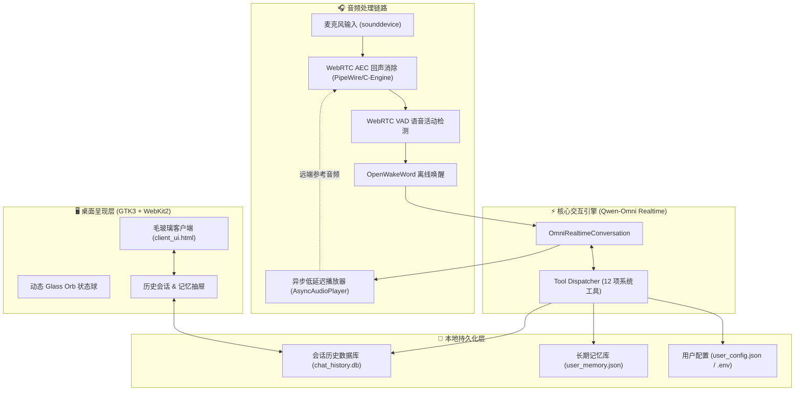

<div align="center">


# Jarvis

**面向 Linux 与 Windows 桌面环境的现代化 AI 管家与智能桌面助理**

[](https://www.python.org/)
[](COPYING)
[](https://github.com/Raindarkstar/Jarvis)
[](https://dashscope.aliyun.com/)
[](https://github.com/Raindarkstar/Jarvis/actions/workflows/ci.yml)
[](#自动化测试)

<p align="center">
  <b>实时语音流交互 (Linux)</b> • <b>Windows 桌面客户端</b> • <b>长期个性化记忆</b> • <b>现代化 UI</b> • <b>系统级控制</b>
</p>

</div>

---

## 📖 简介

**Jarvis** 是一款面向 Linux 与 Windows 的开源桌面智能管家。Linux 版本接入 Qwen-Omni 实时多模态语音大模型，并提供 WebRTC 回声消除（AEC）、离线唤醒词检测与 GTK3/WebKit2 界面；Windows 版本使用系统自带的 Tkinter，提供稳定的文字对话、会话历史、长期记忆以及网页、文件和应用启动能力。

---

## ✨ 核心特性

- 🎙️ **低延迟双工语音交互**：基于 Qwen-Omni Realtime 端到端音频流协议，支持自然语音对话与实时打断（Barge-in）。
- 🛡️ **双层回声消除 (AEC)**：集成 PipeWire 硬件回声消除与 WebRTC AEC 纯 C 加速扩展引擎，确保扬声器播放时麦克风不发生串音或自激。
- ⚡ **离线轻量唤醒**：基于 OpenWakeWord 实现毫秒级离线关键词唤醒，低 CPU/内存占用。
- 🎨 **极简毛玻璃桌面 UI**：采用 GTK3 + WebKitGTK 4.1，提供流式 Markdown 渲染、历史会话抽屉、动态发光 Orb 状态球与快捷键管理（Esc 收起，F11 全屏）。
- 🧠 **分层长期记忆系统**：具备个性化记忆管理（偏好、事实、习惯、常驻城市），支持文件级原子锁并发读写，重启不丢失。
- 🛠️ **12 项系统级工具矩阵**：覆盖系统控制、音量与亮度调节、GUI 模拟、天气/地理位置检索、网页爬取阅读、受控文件管理与命令执行。
- 🔒 **安全沙箱与最小权限**：高危 Shell 执行与破坏性文件删除默认禁用，需通过配置显式授权。

---

## 🏗️ 系统架构



---

## 🛠️ 内置工具矩阵

Jarvis 内置了 12 个可供大模型自主调用的系统级工具：

| 工具名称 | 功能说明 | 安全级别 | 默认状态 |
| :--- | :--- | :---: | :---: |
| `manage_memory` | 记录、回忆或遗忘用户的个性化信息与偏好 | 🟢 安全 | 启用 |
| `set_home_location` | 设置并持久化用户常驻城市（防止 VPN 代理导致定位漂移） | 🟢 安全 | 启用 |
| `get_location` | 获取当前实时地理位置（IP/运营商/经纬度/行政区） | 🟢 安全 | 启用 |
| `get_weather` | 查询指定城市或当前位置的实时气温、天气及未来预报 | 🟢 安全 | 启用 |
| `web_search` | 联网实时搜索新闻、技术文档与即时知识 | 🟢 安全 | 启用 |
| `browser_agent` | 网页抓取、正文提炼与各大平台（B站/GitHub等）搜索 | 🟢 安全 | 启用 |
| `open_application` | 打开指定软件（浏览器、VS Code、终端、计算器等）或网页 | 🟢 安全 | 启用 |
| `control_system` | 调节音量、屏幕亮度、控制媒体播放、锁屏与睡眠 | 🟢 安全 | 启用 |
| `gui_control` | 模拟键盘组合键（Ctrl+C/V、Alt+Tab）、文本输入与鼠标点击 | 🟡 提示 | 启用 |
| `get_system_status` | 实时监测 CPU、内存、磁盘占用、当前活动窗口与系统时间 | 🟢 安全 | 启用 |
| `manage_files` | 读取文件、创建文件或列出目录（覆盖/追加/删除默认受限） | 🟠 受控 | 受限启用 |
| `execute_shell_command` | 在电脑终端执行 Shell 命令（Linux Bash / Windows Shell） | 🔴 高危 | **默认禁用** |

---

## 📦 环境依赖与安装

### 推荐：一键安装

安装脚本会识别 Ubuntu/Debian、Fedora/RHEL 或 Arch，安装系统依赖，创建 `.venv`，执行可编辑安装，编译可选的 AEC 引擎，并注册桌面启动图标：

```bash
chmod +x install.sh
./install.sh
```

脚本默认只安装依赖和创建配置模板，不会覆盖已有的 `.env`。安装完成后编辑 `.env` 填入 API Key，再运行 `jarvis doctor` 检查环境。

### 手动安装

#### 1. 系统依赖要求

适用于 **Ubuntu 22.04 / 24.04**、**Debian 12** 或其他主流 Linux 发行版：

```bash
sudo apt update
sudo apt install -y python3-venv python3-gi python3-cairo gir1.2-gtk-3.0 gir1.2-webkit2-4.1 portaudio19-dev libasound2-dev gcc
```

#### 2. 获取源码与初始化环境

```bash
# 克隆仓库
git clone https://github.com/Raindarkstar/Jarvis.git
cd Jarvis

# 创建并激活虚拟环境（允许访问系统 GTK/GI 组件）
python3 -m venv --system-site-packages .venv
source .venv/bin/activate

# 标准 Python 可编辑安装（也可继续使用 pip install -r requirements.txt）
python -m pip install --editable .
```

#### 3. 配置环境变量

复制环境配置文件并填入你的 DashScope API 密钥：

```bash
cp .env.example .env
```

编辑 `.env` 文件：
```ini
# 阿里云百炼 API Key (必填)
DASHSCOPE_API_KEY=sk-xxxxxxxxxxxxxxxxxxxxxxxxxxxxxxxx

# 实时语音模型与音色 (可选)
QWEN_OMNI_MODEL=qwen3.5-omni-flash-realtime
QWEN_OMNI_VOICE=Tina

# 安全权限开关 (0 为禁用，1 为启用)
RAIN_ALLOW_SHELL_COMMANDS=0
RAIN_ALLOW_DESTRUCTIVE_ACTIONS=0
```

### Windows 桌面版

#### 1. 安装基础环境

先安装以下软件：

- [Git for Windows](https://git-scm.com/download/win)
- [Python 3.12 或更高版本](https://www.python.org/downloads/windows/)

安装 Python 时请勾选 **Add python.exe to PATH**。安装完成后打开 **PowerShell**，确认命令可用：

```powershell
git --version
py --version
```

#### 2. Clone 项目并安装

在 PowerShell 中执行：

```powershell
git clone https://github.com/Raindarkstar/Jarvis.git
cd Jarvis
Set-ExecutionPolicy -Scope Process -ExecutionPolicy Bypass
.\install.ps1
```

`install.ps1` 会自动创建 `.venv` 虚拟环境、安装 Windows 所需依赖，并从 `.env.example` 创建配置文件。

#### 3. 配置 API Key

打开配置文件：

```powershell
notepad .env
```

填写你的 DashScope API Key：

```ini
DASHSCOPE_API_KEY=你的_API_Key
```

保存后运行环境检查：

```powershell
.\.venv\Scripts\jarvis.exe doctor
```

#### 4. 启动 Windows 桌面版

```powershell
.\.venv\Scripts\jarvis.exe desktop
```

以后再次启动时：

```powershell
cd Jarvis
.\jarvis-windows.bat
```

Windows 客户端支持文字对话、历史会话、长期记忆、网页/文件/应用工具和受控命令执行；Linux 专属的实时语音、AEC、唤醒词与 GTK 界面暂未在 Windows 启用。

#### Windows 常见问题

- **无法运行 `install.ps1`**：先执行 `Set-ExecutionPolicy -Scope Process -ExecutionPolicy Bypass`，再重试。
- **找不到 `py` 或 `python`**：重新安装 Python，并勾选 **Add python.exe to PATH**。
- **Tkinter 不可用**：使用 python.org 官方 Python 安装包，不要使用缺少 Tcl/Tk 组件的精简发行版。
- **提示未配置 API Key**：确认 `.env` 位于 Jarvis 项目根目录，并且 `DASHSCOPE_API_KEY` 没有被引号或空格包住。

---

## 🚀 运行与使用

### 启动桌面图形客户端（推荐）

```bash
jarvis desktop
```
> **快捷操作**：
> - `Esc`：收起/隐藏窗口到后台
> - `F11`：切换全屏显示
> - 点击左侧抽屉：查看与切换历史会话、管理长期记忆库

### 启动独立语音服务（后台无界面模式）

```bash
jarvis voice
```

### 环境自检

启动异常时先运行：

```bash
jarvis doctor
```

它会根据当前平台检查 Python 版本、DashScope 配置、Python 模块和桌面能力。Linux 还会检查 GTK/WebKitGTK、音频输入输出、AEC 引擎与 X11/Wayland 会话；Windows 会检查 Tkinter 和系统打开能力。`--json` 可用于脚本或问题反馈；输出不会包含 API Key：

```bash
jarvis doctor --json
```

如果尚未完成安装，也可以直接使用源码环境运行 `./bin/python -m jarvis_cli doctor`。

### 桌面图标安装

`./install.sh` 会自动注册应用图标。手动安装时，可将 `jarvis.desktop` 复制到 `~/.local/share/applications/`，并将其中的 `Exec` 路径改为当前仓库的 `jarvis-client.sh`。

---

## 🧪 自动化测试

项目内置了完整的单元测试集，涵盖并发内存锁、会话数据完整性、工具协议定义与安全防御：

```bash
python -m unittest discover -s tests -v
```

---

## 🔒 隐私与安全性

1. **隐私隔离**：`.env`、个人配置（`user_config.json`）、记忆文件（`user_memory.json`）、聊天历史（`chat_history.db`）以及临时音频均已配置在 `.gitignore` 中，绝不会被意外推送到公开仓库。
2. **高危指令沙箱**：执行 Shell 命令与破坏性文件删除默认处于关闭状态，防止大模型误操作带来系统级风险。

---

## 🗺️ 发展路线 (Roadmap)

- [ ] **多模型与离线支持**：接入 Ollama / Whisper / Piper TTS，提供离线完全私密运行模式。
- [ ] **MCP (Model Context Protocol) 插件系统**：支持动态加载外部扩展工具。
- [ ] **Wayland 原生深度兼容**：适配 `ydotool` / `wlrctl` 及 Wayland 协议下的全局快捷键。
- [ ] **系统托盘驻留**：增加 System Tray 指示器，支持快捷键随时全局唤醒。
- [x] **一键安装向导**：提供跨发行版 `install.sh` 与 `jarvis doctor` 环境自检诊断工具。

---

## 📄 开源许可证

本项目基于 **GPL-3.0** 许可证开源，详情请参阅 [COPYING](COPYING) 文件。
