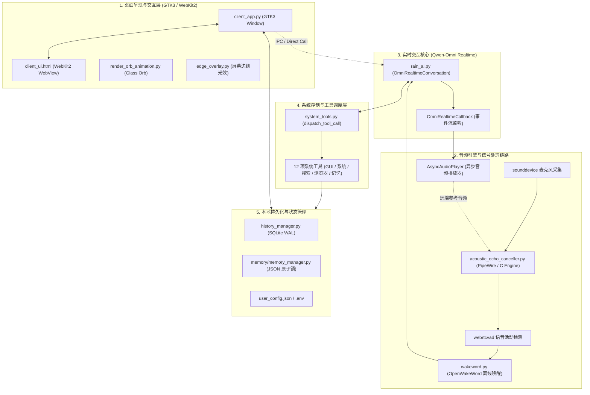

# Jarvis 架构设计与技术文档

本文档详细介绍了 **Jarvis** Linux 智能桌面助理的系统架构、核心组件设计、音频处理链路、大模型实时协议以及持久化存储方案。

---

## 1. 架构总览

Jarvis 采用分层解耦的架构设计，主要分为以下五大核心模块：

---

## 2. 核心模块详解

### 2.1 音频处理与回声消除链路 (Audio & AEC Pipeline)

全双工语音交互中最棘手的问题是 **扬声器声音回串到麦克风导致大模型自言自语**。Jarvis 设计了双层回声消除方案：

1. **PipeWire 原生 AEC**：
   - 优先通过 PipeWire 的 `libpipewire-module-echo-cancel` 模块在 Linux 音频服务端直接构建硬件参考与消回声流。
2. **纯 C 加速软件 AEC 引擎 (`aec_engine.c`)**：
   - 当 PipeWire 模块不可用时，通过 `ctypes` 载入编译生成的 `libaec.so`。
   - `AsyncAudioPlayer` 播放的每一段 24kHz/16kHz 音频切片都会实时推入 AEC 远端参考环形缓冲区（Far-end Ring Buffer）。
   - 麦克风录入音频（Near-end）与远端参考进行实时对齐与滤波消除，输出纯净的人声。
3. **低延迟打断 (Barge-in)**：
   - `AsyncAudioPlayer` 维护全局 `generation` 标识。当检测到用户在 AI 说话时开口打断，立即清空播放队列并递增代数，丢弃后续已接收到的音频帧，实现毫秒级打断。

---

### 2.2 大模型实时流式协议 (Qwen-Omni Realtime Protocol)

在 `rain_ai.py` 中，Jarvis 基于 DashScope 的 `OmniRealtimeConversation` 建立全双工实时 WebSocket 会话：

- **输入流**：以 16kHz, 16-bit PCM 格式以 100ms 切片持续发送用户语音。
- **输出流**：异步接收服务端返回的 24kHz PCM 音频块和文本片段。
- **函数调用 (Tool Call)**：
  - 当模型输出 `function_call` 事件时，客户端解析工具名称与 JSON 参数。
  - 调用 `system_tools.dispatch_tool_call()` 执行对应操作。
  - 将执行结果包装为 `function_call_output` 事件回传给大模型，模型自动总结并口语化汇报结果。

---

### 2.3 现代化毛玻璃桌面客户端 (GTK3 + WebKit2)

`client_app.py` 采用无边框设计与 Cairo 透明背景混合渲染：

- **窗口管理**：
  - 支持快捷键 `Esc`（隐藏至后台）、`F11`（全屏/还原）。
  - 支持无边框窗体拖拽移动与边缘缩放。
- **双向消息桥 (JS Bridge)**：
  - 前端 JavaScript 通过 `window.webkit.messageHandlers.clientAction.postMessage()` 向 Python 发送动作（发送消息、创建会话、切换模式、删除记忆等）。
  - Python 通过 `webview.run_javascript()` 将流式 Markdown Token、状态更新与系统消息推送到前端渲染。

---

### 2.4 数据持久化与并发安全 (Storage & Concurrency)

Jarvis 将所有用户数据严格保存在本地，兼顾高效查询与多进程/多线程并发安全：

1. **会话历史数据库 (`memory/chat_history.db`)**：
   - 基于 SQLite3 实现，采用 `WAL` (Write-Ahead Logging) 模式与 `FOREIGN KEYS` 外键约束。
   - 支持多会话隔离、分页消息拉取、会话软/硬删除。
2. **长期记忆库 (`memory/user_memory.json`)**：
   - 基于 JSON 格式存储用户画像、偏好、习惯与常驻城市。
   - 使用跨平台文件锁（`fcntl.flock`）保证多线程/多进程读写时的原子性与数据一致性，权限固定为 `0600`。

---

## 3. 安全设计原则

| 原则 | 实现方式 |
| :--- | :--- |
| **最小权限原则** | 高危 Shell 执行 (`execute_shell_command`) 和文件删除 (`manage_files:delete`) 默认全局关闭，需在 `.env` 中显式开启。 |
| **防注入校验** | 对系统音量、屏幕亮度等动态 Shell 拼接参数进行严格的正则匹配，拦截 `;`, `&&`, `|` 等恶意注入字符。 |
| **本地隐私隔离** | 密钥、录音缓存、对话历史与记忆库默认加入 `.gitignore`，杜绝敏感凭据泄露。 |
